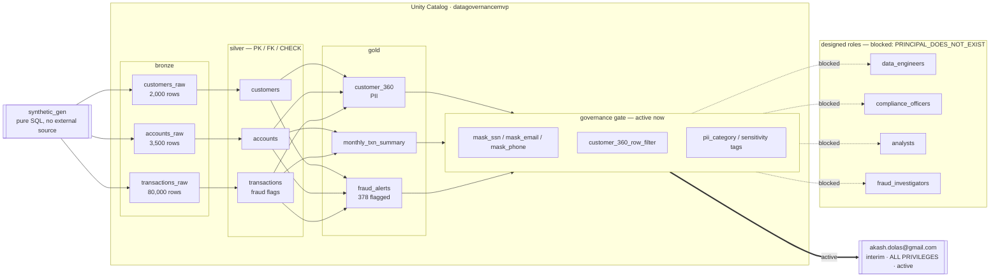

# Data Governance MVP (Databricks / Unity Catalog)

An end-to-end medallion pipeline built on the `datagovernancemvp` Unity Catalog catalog, demonstrating
a banking/fraud use case with Unity Catalog governance layered on top: PII tags, column masking,
row-level security, and role-scoped grants.

## Project Summary

**Business problem**
A bank's fraud, compliance, analytics, and engineering teams all need access to the same
customer/account/transaction data, but not the same *view* of it: fraud investigators need to see
flagged activity without full PII exposure, compliance needs full unmasked visibility for audits,
analysts need aggregate insight without touching raw PII, and engineers need full build/ops access.
Without a governed platform, this typically means duplicated datasets, ad hoc masking in BI tools,
and no single source of truth for who can see what. This MVP demonstrates a single governed catalog
that serves all four audiences from the same physical tables.

**Source data**
Synthetic banking data standing in for a core-banking source system: ~2,000 customers, ~3,500
accounts, ~80,000 transactions, generated entirely in SQL so the project runs standalone with no
external system dependency. Schema mirrors a real source: customer PII (name, SSN, email, phone,
DOB, address), account attributes (type, status, branch country), and transaction detail (amount,
merchant, channel, country, timestamp).

**Ingestion method**
Batch ingestion into `bronze` landing tables (`customers_raw`, `accounts_raw`, `transactions_raw`)
via a SQL notebook (`01_bronze_ingest.sql`), orchestrated as the second task in a 7-task Databricks
Job (`datagovernancemvp_pipeline`) running on serverless notebook compute — no cluster to provision
or manage. In production, this notebook would be replaced by a CDC or batch feed from the core
banking system; the downstream pipeline is agnostic to that swap.

**Transformation logic**
Two-stage transformation: bronze → silver dedupes on primary key, trims/casts/types fields, and
applies rule-based fraud flagging (`is_flagged`, `flagged_reason` on amount and country thresholds);
silver → gold aggregates into three consumption tables — `customer_360` (per-customer rollup),
`monthly_transaction_summary` (per-account/month aggregates), and `fraud_alerts` (flagged
transactions joined with customer context). Each stage is idempotent (`CREATE OR REPLACE`,
`INSERT OVERWRITE`), so reruns are safe.

**Storage layer**
Unity Catalog managed Delta tables in the `datagovernancemvp` catalog, organized into `bronze`,
`silver`, `gold`, and `governance` schemas (medallion architecture), backed by the metastore's S3
storage root. All object creation, grants, and metadata live in Unity Catalog rather than a
workspace-local Hive metastore, so access control and lineage are governed centrally.

**Optimization and reliability**
PK/FK/CHECK constraints on all silver tables; a standalone data-quality suite
(`governance.dq_results`) validating row counts, duplicate keys, orphaned foreign keys, and invalid
amounts (all checks currently PASS); predictive optimization inherited from the metastore; a
task-dependency DAG in the Job that fails fast and skips downstream tasks on error, which is how the
governance-layer bug below was caught before it silently shipped bad access control.

**Business result**
A working, queryable governed dataset: PII columns (`ssn`, `email`, `phone`, `dob`) are masked by
default and tagged for classification (`pii_category`, `sensitivity`); 378 of 80,000 transactions
(0.47%) are surfaced in `gold.fraud_alerts` for investigation; row-level security scopes fraud
investigators to only the customers relevant to their queue; and audit/lineage observability is
available directly from `system.access.audit` and `system.access.table_lineage`. One real
governance gap surfaced during build: the four role groups exist only as workspace-local identities
in this account, not account-level ones, so Unity Catalog can't grant to them yet — documented and
fixed with an interim single-user grant, with the intended role-scoped grants ready to activate once
an account admin promotes the groups (see **Governance model** below).

## Architecture

A full interactive version (with a data-quality snapshot and a legend) lives at
[`docs/architecture-diagram.html`](docs/architecture-diagram.html) — open it in a browser. Quick
view:



Data is synthetically generated in pure SQL (`01_bronze_ingest.sql`) so the project runs standalone
with no external source system: ~2,000 customers, ~3,500 accounts, ~80,000 transactions.

## Pipeline (`/sql`)

Run in order (also wired as a Databricks Job, see `/job`):

| # | Notebook | Purpose |
|---|----------|---------|
| 00 | `00_setup_catalog_schemas.sql` | Creates `bronze`, `silver`, `gold`, `governance` schemas + catalog tags |
| 01 | `01_bronze_ingest.sql` | Generates synthetic customers/accounts/transactions into bronze |
| 02 | `02_silver_transform.sql` | Dedupes, types, and constrains data into silver (PK/FK/CHECK constraints, rule-based fraud flags) |
| 03 | `03_gold_aggregate.sql` | Builds `customer_360`, `monthly_transaction_summary`, `fraud_alerts` |
| 04 | `04_governance_apply.sql` | Applies column masks, row filter, PII tags, and role-scoped grants |
| 05 | `05_data_quality_checks.sql` | Referential/quality checks persisted to `governance.dq_results` |
| 06 | `06_audit_lineage_demo.sql` | Reads `system.access.audit`, `system.access.table_lineage`, `information_schema` for observability |

## Governance model

The design is role-scoped around four groups: `data_engineers`, `compliance_officers`,
`analysts`, `fraud_investigators`. **Known environment gap:** these currently exist only as
workspace-local groups in this Databricks account, not account-level identities — Unity Catalog
can only grant privileges to account users, service principals, or account-level groups, so
`GRANT ... TO \`data_engineers\`` fails with `PRINCIPAL_DOES_NOT_EXIST`. Promoting them requires
account-admin rights on the Databricks account (this deployment only had workspace-admin rights).
Until that's done, `04_governance_apply.sql` grants everything to the single account user
(`akash.dolas@gmail.com`) so the pipeline, masks, and row filter still deploy and run end-to-end;
the intended role-scoped grants are included commented-out, ready to swap in once an account admin
promotes the groups.

| Role | Silver | `gold.customer_360` | `gold.fraud_alerts` | PII visibility |
|---|---|---|---|---|
| `data_engineers` | Full (owner) | Full | Full | Unmasked |
| `compliance_officers` | Read | Full | Full | Unmasked |
| `analysts` | — | Read (masked, all rows) | — | Masked |
| `fraud_investigators` | — | Read (masked, **flagged customers only**) | Full | Masked |

- **Column masking**: `governance.mask_ssn/mask_email/mask_phone` reveal real values only to
  `compliance_officers`, `data_engineers`, `admins`; everyone else sees a masked value.
  Masks are applied on `gold.customer_360` only — Unity Catalog does not support column masks on
  tables carrying `CHECK` constraints, which `silver.customers` has (`chk_customers_dob`). Since
  silver access is limited to roles already unmasked by the function logic, this has no governance gap.
- **Row-level security**: `governance.customer_360_row_filter` restricts `fraud_investigators` to
  customers with at least one flagged transaction; every other granted role sees all rows.
- **Tags**: PII columns (`ssn`, `email`, `phone`, `dob`) are tagged `pii_category`/`sensitivity`
  at the column level; schemas and the catalog carry classification tags too.
- **Data quality**: PK/FK/CHECK constraints on silver tables, plus a standalone check suite
  (`governance.dq_results`) validating row counts, orphan keys, and non-positive amounts.

## Deploying

```powershell
databricks workspace import-dir sql /Workspace/Users/<you>/datagovernancemvp --profile <profile>
databricks jobs create --json @job/job_definition.json --profile <profile>
databricks jobs run-now <job_id> --profile <profile>
```

`job/job_definition.json` is the deployed job spec (7 sequential tasks, serverless notebook
compute, no cluster to manage). Update the `notebook_path` values if deploying under a different
workspace user.

## Catalog

- Metastore-registered catalog: `datagovernancemvp`
- Warehouse used for ad-hoc queries: the workspace's serverless SQL warehouse
